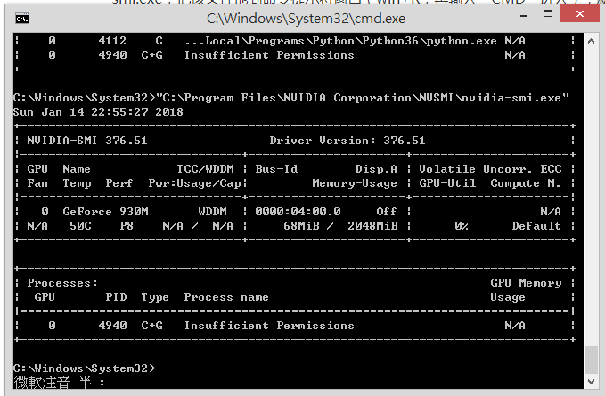
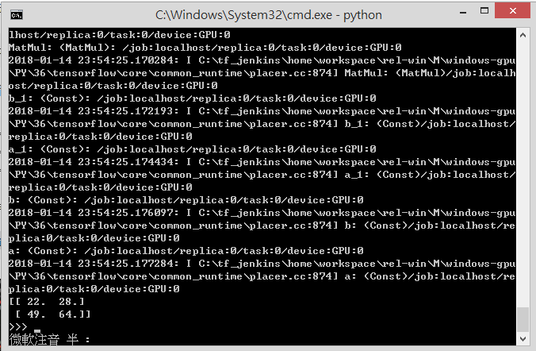

# TensorFlow GPU 執行環境安裝

## 使用環境

| os | nvidia-driver | cuda | cudnn | GPU | tensotflow | tensotflow-gpu |
| --- | --- | --- | --- |--- |--- |--- |
| windows 10 (WSL2) (64) | 460.20 | 10.1 | 7.6.5 | GeForce 1650 Ti(4G) | 2.3.1 | 2.3.1 |
| ubuntu 18.04 (64) | 450.36 | 10.1 | 7.6.5 | GeForce 1060(6G) | 2.2.0 | 2.2.0 |
| ubuntu 18.04 (64) | 390.48 | 9.0 | 7.0 | GeForce 1060(6G) | 1.10.0 | 1.10.0 |
| ubuntu 18.04 (64) | 390.48 | 9.0 | 7.0 | GeForce 1050(2G) | 1.10.0 | 1.10.0 |
| windows 8.1 (64) | 385.54 | 9.0 | 7.0 | GeForce 930M(2G) | 1.11.0 | 1.11.0 |
| windows 8.1 (64) | 376.51 | 8.0 | 6.0 | GeForce 930M(2G) | 1.4.0 | 1.4.0 |

## TensorFlow GPU 版本說明

TensorFlow 要利用 GPU 強大的平行運算功能，必須安裝TensorFlow GPU 版本。 Tensorflow GPU 版本:主要是透過 NVIDIA 提供的 CUDA 和 CudNN，才能運用 GPU 執行深度學習訓練。

## 顯示卡要求

要使用 NVIDIA GPU 加速 TensorFlow，首先要有支持 CUDA Compute Capability 3.0 以上的 NVIDIA GPU 設備。 CUDA 是 NVIDIA 推出的一套並行計算平台和 API，NVIDIA 各產品的支持情況可以在[這裡](https://developer.nvidia.com/cuda-gpus)找到。

## 兼容性問題

- python3.6 + cuda8 + cuDNN6
- python3.5 + cuda8 + cuDNN6

一般在 python3.5 的組合下，需要 Micrsolft Visual C++ 2015 Redistributable，但在 python3.6 需要的是 Micrsolft Visual C++ 2017 Redistributable。本身嘗試了第一個組合是可行的而且過程似乎也比較容易。

## 安裝 TensorFlow GPU 版本

- 版本安裝
    - 2.XX
        - CPU, GPU 版本合併
    - 1.XX
        - 在 CMD 輸入 "pip3 install tensorflow-gpu"。如果之前已經安裝過 tensorflow ，切記 CPU 和 GPU 版本要相同。

- GPU 使用狀況查詢
    - WSL2: cmd 直接下 nvidia-smi
    - linux: terminal 直接下 nvidia-smi
    - windows: 查看 GPU 使用狀況。在文件夾 C:\Program Files\NVIDIA Corporation\NVSMI 裡找到文件 nvidia-smi，把該文件拖到 CMD。就可以顯示關於GPU的信息，如下圖所示：

    

## 測試安裝是否成功

- tensotflow 2.X GPU

    ```python
    import tensorflow as tf

    print(tf.test.is_gpu_available())
    ```

- tensotflow 1.X GPU

    打開cmd，輸入以下指令打開 python 的 interactive shell。

    首先導入 tensorflow:

    ```python
    import tensorflow as tf
    ```

    依序完成下列程式，應該可以看到下圖中表明你的GPU已經開始工作啦。

    ```python
    a = tf.constant([1.0, 2.0, 3.0, 4.0, 5.0, 6.0], shape=[2, 3], name='a')
    b = tf.constant([1.0, 2.0, 3.0, 4.0, 5.0, 6.0], shape=[3, 2], name='b')
    c = tf.matmul(a, b)

    sess = tf.Session(config=tf.ConfigProto(log_device_placement=True))

    print(sess.run(c))
    ```

    
