# 安裝 Hadoop Multi Node Cluster

Hadoop Multi Node Cluster 主要概念:

* 由多台電腦組成: 有一台主要的電腦 master，在 HDFS 擔任 NameNode 角色，在 MapReduce2(YARN) 擔任 ResourceManager 角色。
* 有多台的電腦，在 HDFS 擔任 DataNode 角色，在 MapReduce2(YARN) 擔任NodeManager角色 

由於我只有一台電腦，所以會藉由 VirtualBox 建立多台虛擬主機來來練習，本次練習主要會建立一台 master，三台 data。


## 安裝步驟

1. 複製 Single Node Cluster 到 data1
2. VirtualBox 介面卡設定 
3. 設定 data1 伺服器 
4. 複製 data1 伺服器至data2、data3、master
5. 設定 data2 伺服器
6. 設定 data3 伺服器
7. 設定 master 伺服器 
8. master 連線至 data1、data2、data3 建立 HDFS 目錄
9. 建立與格式化 NameNode HDFS 目錄
10. 啟動 Hadoop Multi Node cluster
11. 開啟 Hadoop Resource-Manager Web 介面
12. 開啟 NameNode Web 介面


## 複製 Single Node Cluster 到 data1

* 複製 hadoop 到 data1，如下圖指示，點選再製。

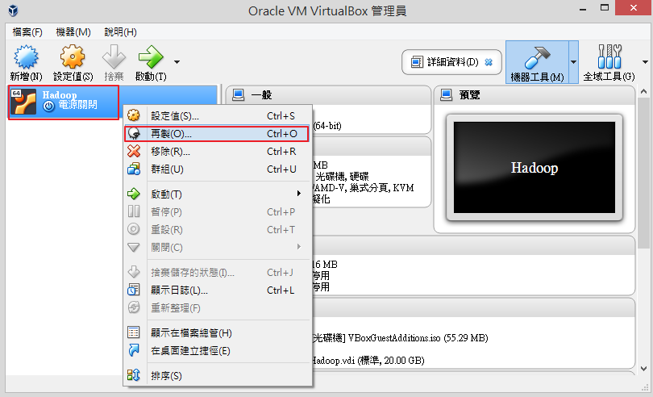

* 設定虛擬主機名稱
  * 輸入虛擬機器名稱 data1
  * 勾選 "初始化所有網路卡的MAC位址(R)"，然後下一步

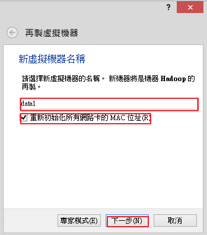

* 設定再製類型
  * 選擇完整再製，然後再製

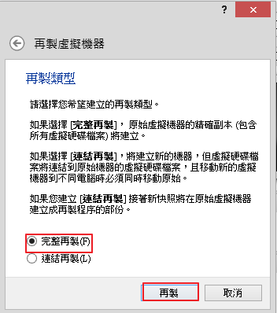

* 再製完成，如下圖

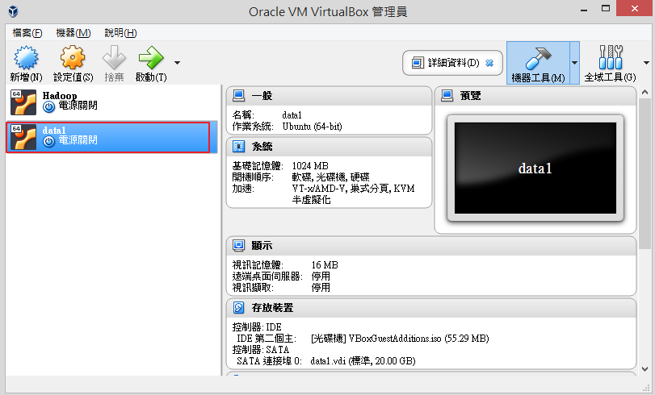


## VirtualBox 介面卡設定 

本次 VirtualBox 介面卡設定如下圖所示:

* 最右邊為我的電腦(windows)，前幾章已經在電腦裡安裝 VirtualBox 的虛擬主機軟體，然後我們在 VirtualBox 上面建立四台虛擬主機，分別為 master、data1、data2、data3
* 在每一台虛擬主機都設定兩張介面卡
    * 介面卡一:可以透過 Host 主機連結至外部網路
    * 介面卡二:設定為 "內部網路介面卡"，用於建立內部網路，內部網路連結虛擬主機(master、data1、data2、data3)

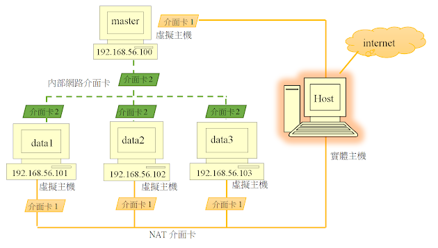

* 設定介面卡
  * 點選 data1 虛擬機
  * 點選設定值
  * 點選網路
  * 介面卡1
    * 選擇 "NAT" 介面卡
  * 介面卡2
    * 點選 "啟動網路卡"
    * 選擇內部網路
  * 最後點選確認  

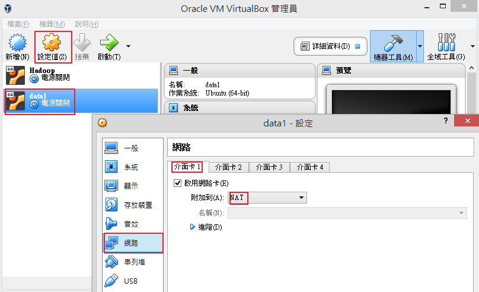

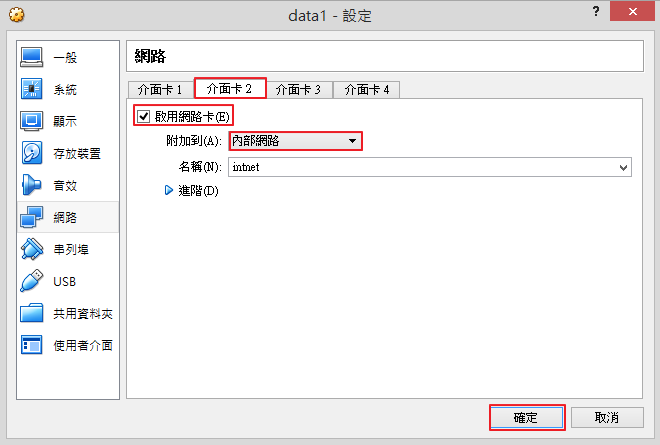


## 設定 data1 伺服器 

設定 Muti Node Cluster 伺服器，組態設定檔共通部分:固定 ip、hostname、core-site.xml、yarn-site.xml、mapred-site.xml、hdfs-site.xml。

* 啟動 data1 伺服器
  * 點選 data1 伺服器，然後啟動


* 在 data1 終端機執行下列指令，設定 data1 虛擬主機每次開機都是使用固定 IP:192.168.56.101

```
sudo gedit /etc/network/interfaces
```

* 執行完指令會開啟 interfaces 檔案，輸入下圖紅框內容，然後儲存，離開
  * 設定介面卡 1 (上方紅框)
    * 設定為 "NAT 介面卡"，可以透過 Host 主機連結至外部網路，設定為 enp0s3，並且設定 dhcp 自動取得 ip 位址
  * 設定介面卡 2 (下方紅框)
    * 設定為 "內部網路介面卡"，用於建立內部網路，內部網路連結虛擬主機(master、data1、data2、data3) 與 Host 主機。設定為 enp0s8，並且設定 static 指定固定 ip 位址

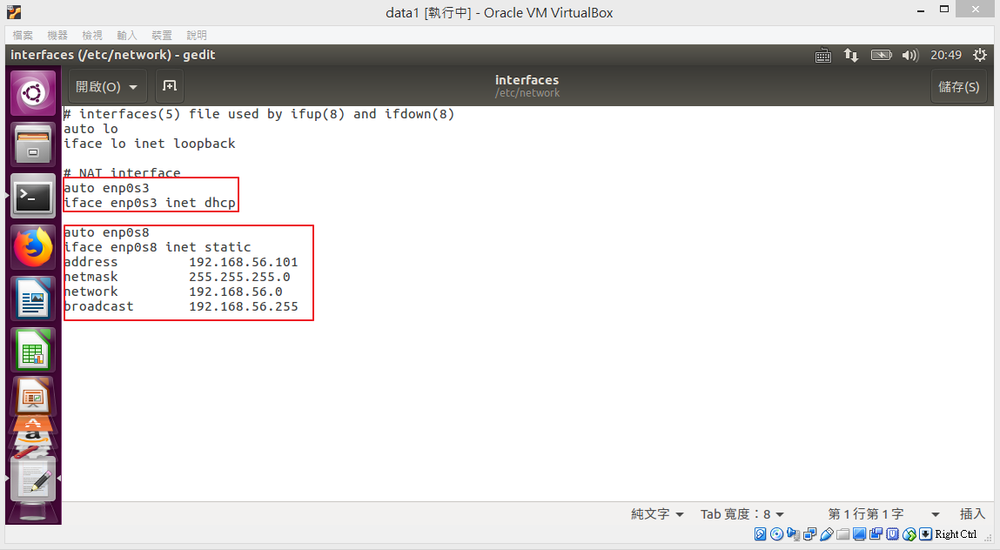

* 設定 hostname
  * 設定 data1 的 HOSTNAME (主機名稱)，如下指令

```
sudo gedit /etc/hostname
```

* 執行完指令會開啟 hostname 檔案，輸入下圖紅框內容，然後儲存，離開


* 設定 hosts 檔案，輸入如下指令
  * hosts 檔案通常用來補充或取代網路中的 DNS 的功能。和 DNS 不同的是電腦使用者可以直接對 hosts 檔案進行控制。hosts 檔案可儲存電腦網路中各節點資訊，負責將主機名稱對映到相對應的 IP 位址

```
sudo gedit /etc/hosts
```

* 執行完指令會開啟 hosts 檔案，輸入下圖紅框內容(每一台主機對應的 IP)，然後儲存，離開

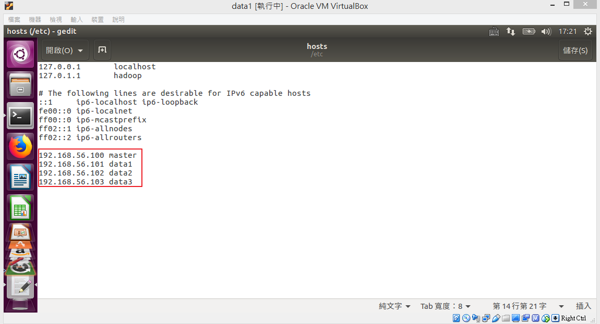

* 編輯 core-site.xml
  * 後續如果使用程式讀取 HDFS 時，會使用 hdfs://master:900 這個位址來存取 HDFS，指令如下

```
sudo gedit /usr/local/hadoop/etc/hadoop/core-site.xml
```

* 執行完指令會開啟 core-site.xml 檔案，將下圖紅框內容 localhost 改成 master，然後儲存，離開

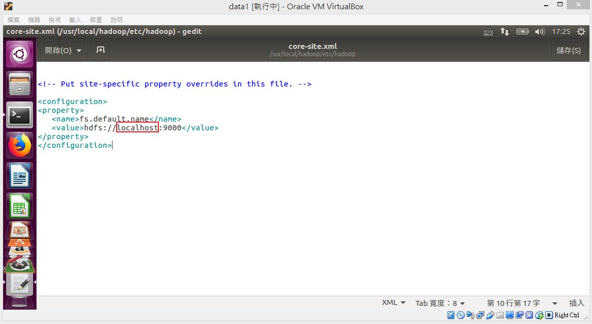

* 編輯 yarn-site.xml
  * yarn-site.xml 檔案功能是 MapReduce2(YARN) 相關的組態設定，指令如下

```
sudo gedit /usr/local/hadoop/etc/hadoop/yarn-site.xml
```

* 執行完指令會開啟 yarn-site.xml 檔案，輸入下圖紅框內容(在 "configuration"之間)，然後儲存，離開
  * ResourceManager 主機與 NodeManager 的連接位址 8025
  * ResourceManager 與 ApplicationMaster 的連接位址 8030
  * ResourceManager 與客戶端的連接位址 8050

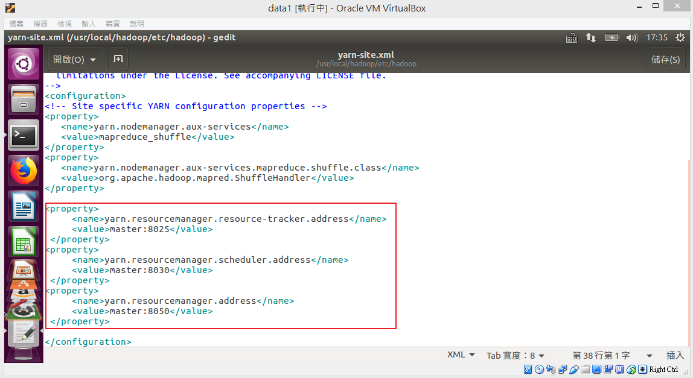

* 編輯 mapred-site.xml 
  * mapred-site.xml 用於設定監控 Map 與 Reduce 程式的 JobTracker 工作分配狀況，以及 TaskTracker 工作執行狀況，指令如下

```
sudo gedit /usr/local/hadoop/etc/hadoop/mapred-site.xml
```

* 執行完指令會開啟 mapred-site.xml 檔案，修改成下圖紅框內容(在 "configuration"之間)，然後儲存，離開

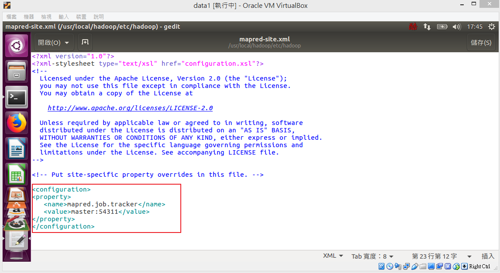


* 編輯 hdfs-site.xml 
  * hdfs-site.xml 用於設定 HDFS 分散式檔案系統相關組態設定。之前在 Single Node Cluster 因為只有一台伺服器，所以同時身兼 NameNode 與 DataNode 角色。但 data1 現在只是單存 DataNode，所以請移除 NameNode 設定，只保留 DataNode 設定，指令如下
  
```
sudo gedit /usr/local/hadoop/etc/hadoop/hdfs-site.xml
```

* 執行完指令會開啟 hdfs-site.xml 檔案，修改成下圖紅框內容(在 "configuration"之間)，然後儲存，離開

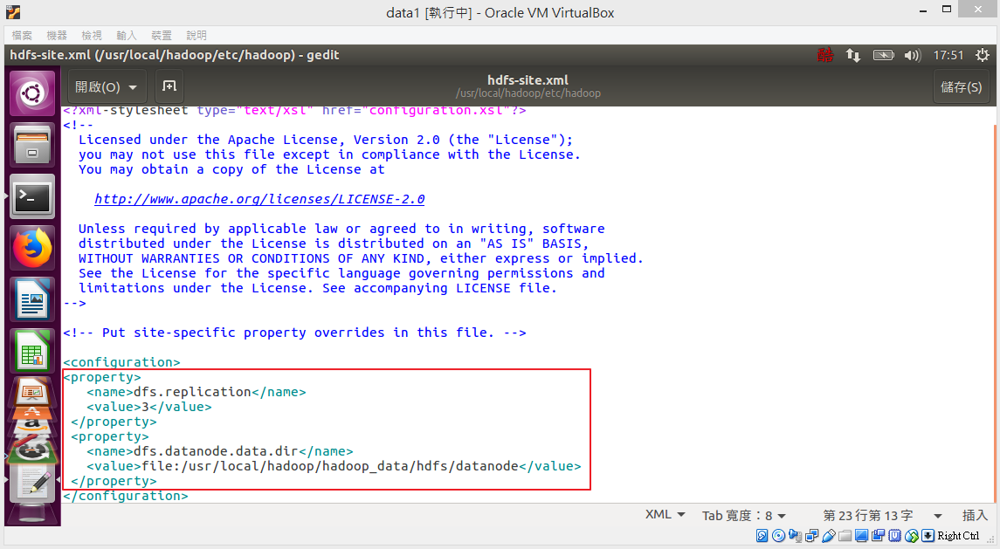

* data1 重新啟動，確認網路設定
  * 重新啟動之後在 data1 終端機輸入如下指令

```
ifconfig
```

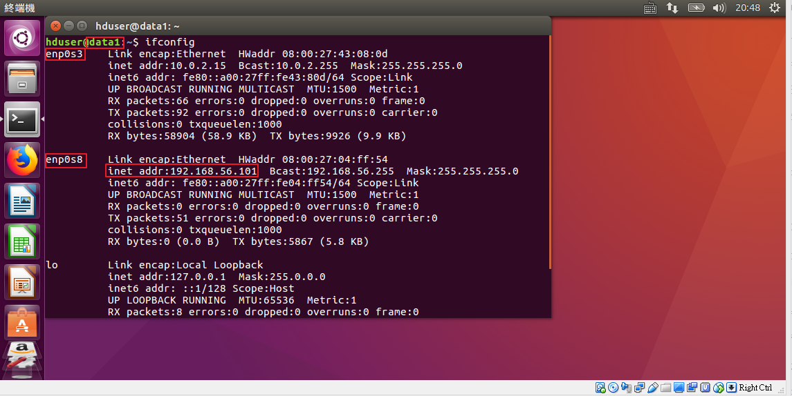


## 複製 data1 伺服器至 data2、data3、master


## 設定 data2 伺服器


## 設定 data3 伺服器


## 設定 master 伺服器


## master 連線至 data1、data2、data3 建立 HDFS 目錄


## 建立與格式化 NameNode HDFS 目錄


## 啟動 Hadoop Multi Node cluster


## 開啟 Hadoop Resource-Manager Web 介面


## 開啟 NameNode Web 介面